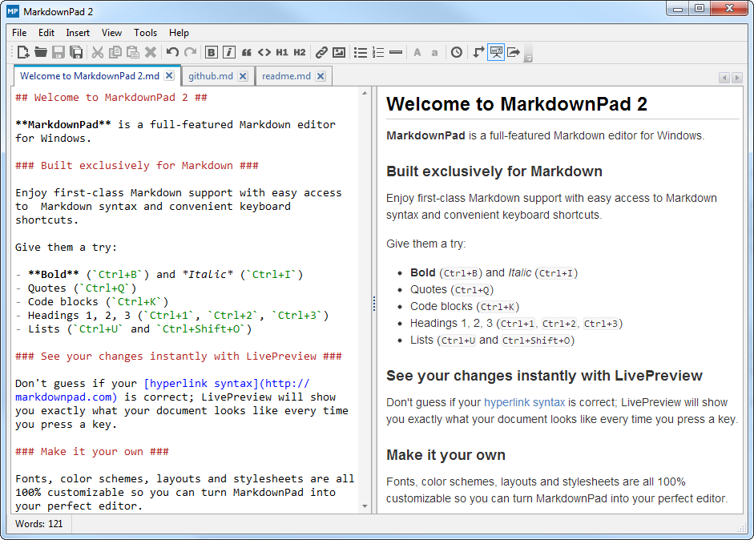
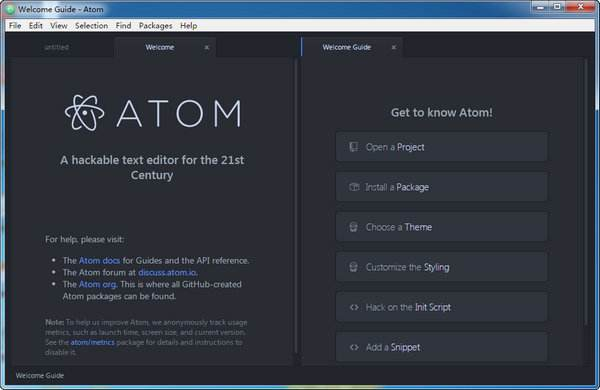
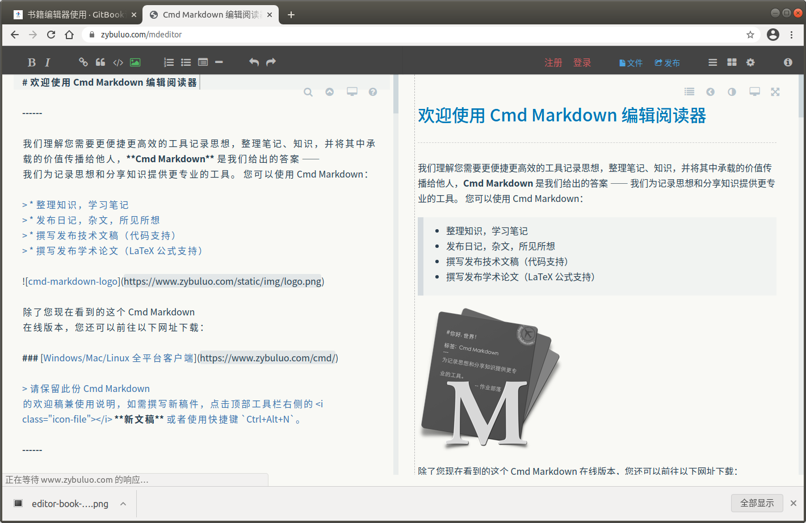

# 编辑器类型

`Gitbook` 是基于 `Markdown` 语法文档的书籍制作工具，除了配置文件，所有书籍的页面文件都是 Markdown 类型的文档文件，目前可用的 **Markdown 的编辑器** 有很多种，简单向大家介绍一些比较常用的相关的 Markdown 编辑器。

>  [!NOTE|style:flat]
> 按照 Markdown 编辑器的使用环境，可以将它们归纳为三类。
> 1. 平台集成工具：各大在线博客、社区平台自带的写作工具，比如CSDN、博客园、简书等。
> 2. 独立软件类：下载到自己机器上使用的独立产品，可以编辑本地文件，比如Mou、MarkdownEditor、Haroopad等。
> 3. 插件类：他自己本身是不能独立使用的，可以在你现有的主流编辑器安装，使你现有的编辑器具有Markdown的功能，比如Atom、WebStorm、Sublime Text等。

这三类软件分别面向三类不同 Markdown 需求的用户，大家可以根据自己的需求来选择使用。

# MarkdownPad

`MarkdownPad`被很多人称赞为windows下最好用的Markdown编辑器之一，不过仅支持windows。它有免费版和收费版（MarkdownPad Pro），一般情况下免费版就够用了，需要用pro版的可以自行购买。

MarkdownPad支持键盘快捷键和工具栏操作，即可添加标记也可移除，支持即时HTML预览、支持自定义配色方案、字体、大小和布局、支持音乐视频，可以导出 HTML 和 PDF。

详细说明和使用参考官网：<http://markdownpad.com>

**界面预览：**

# Typora

`Typora` 也是非常用名，非常好用的 Markdown 编辑器，它的设计理念很不一样，是真正的即时预览型编辑器，不同于左右两个窗口的编辑器。Typora的设计理念就是极致简洁，它将「写字」和「预览」这两件事情合并了。

如果要修改已经写好的 Markdown 标记可以点击切换到“源代码模式”。

Typora 同样支持 Windows、OS X 和 Linux多个操作系统，支持数学编辑，可与 Word 直接格式转换，可以进行多种文档格式转换。Typora 流畅度和反应速度很快，特别适合那些手速快的人。

详细说明和使用参考官网：<https://www.typora.io>

**界面预览：**

# Mou

`Mou` 是一款由国人开发的 Markdown 编辑器，支持实时预览，但是仅支持 苹果操作系统，可以说是目前最好用的免费 Markdown 编辑器，对汉字兼容性非常好。提供语法高亮、在线预览、同步滚动、全屏模式，支持自定保存、自动匹配，允许自定义主题等等。支持 CSS，HTML 和 PDF 导出等功能。

详细说明和使用参考官网：<http://25.io/mou>

**界面预览：**

# Atom

`Atom` 可以说是专门为程序员推出的一个文本编辑器，界面简洁，支持实时预览。功能非常多，除了Markdown 同时支持 CSS，HTML，JavaScript 等网页编程语言，还支持宏定义，自动分屏功能等。Atom还具有语义输入模式，比例输入code即会自动开启代码模式。

Atom 支持 windows、苹果、linux 等多种操作系统。Atom是由著名的 Github 平台出品的。

Atom有独立的软件，也支持插件方式。

详细说明和使用参考官网：<https://atom.io>

**界面预览：**

# Haroopad

`Haroopad` 也是一款非常流行的编辑器，来自韩国。Haroopad 支持 Windows、Mac OS X 和 Linux三大操作系统。Haroopad 的特色是主题样式丰富，语法高亮支持无数种编程语言，几乎你能想到的编程语言他都支持。Ubuntu/Linux 用户使用该工具比例很高，Haroopad 也是开源免费的。Haroopad也支持导出HTML、PDF，也支持数学公式和流程图。

详细说明和使用参考官网：<http://pad.haroopress.com/user.html>

**界面预览：**

# Cmd Markdown

`Cmd Markdown` 是一款不错的写作工具，同时也兼顾博客等写作平台，国内作业部落出品，同时支持Windows、苹果、Linux操作系统，也有 Web 在线创作平台，界面很舒服。

Cmd Markdown有独立的软件、也有平台集成版本。

详细说明和使用参考官网：<https://www.zybuluo.com/mdeditor>

**界面预览：**

# 最后

 Markdown 的编辑器远远不止这些，这里就简单的介绍了一些比较常用的几款 Markdown 的文本编辑器，相信对于大多数人来说已经够用了。如果有其他编辑器功能需要的，可以根据自己的需要自行在网上找适合自己的编辑器。