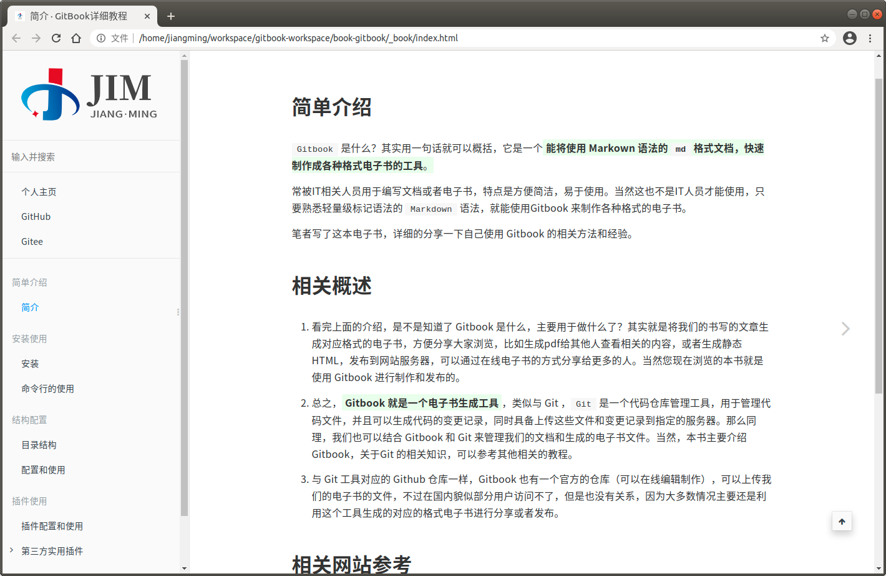

<!-- ex_nonav -->
<!-- ex_nolevel -->

# 导出书籍为HTML格式的静态网站


`Gitbook` 默认静态编译就是 HTML 格式的静态网站，默认导出文件到书籍目录的下的 `_book` 中。

在书籍目录终端中执行 `gitbook build` 命令就可以将书籍导出到目录 `_bo0k` 目录中HTML的静态网页HTML文件。


**参考示例：**


```bash
# 静态编译导出HTML静态网站文件，如果需要查看生成日志过程，可以加上--log=debug
$ gitbook build
info: 28 plugins are installed 
info: 22 explicitly listed 
info: loading plugin "insert-logo"... OK 
info: loading plugin "favicon"... OK 
info: loading plugin "search-pro"... OK 
info: loading plugin "splitter"... OK 
info: loading plugin "github"... OK 
info: loading plugin "sharing-plus"... OK 
info: loading plugin "code"... OK 
info: loading plugin "advanced-emoji"... OK 
info: loading plugin "emphasize"... OK 
info: loading plugin "image-captions"... OK 
info: loading plugin "anchor-navigation-expand"... OK 
info: loading plugin "alerts"... OK 
info: loading plugin "flexible-alerts"... OK 
info: loading plugin "auto-scroll-table"... OK 
info: loading plugin "lightbox"... OK 
info: loading plugin "tbfed-pagefooter"... OK 
info: loading plugin "hide-element"... OK 
info: loading plugin "prism"... OK 
info: loading plugin "chapter-fold"... OK 
info: loading plugin "donate"... OK 
info: loading plugin "fontsettings"... OK 
info: loading plugin "theme-default"... OK 
info: found 38 pages 
info: found 26 asset files 
warn: "options" property is deprecated, use config.get(key) instead 
warn: "options.generator" property is deprecated, use "output.name" instead 
warn: "this.generator" property is deprecated, use "this.output.name" instead 
warn: "navigation" property is deprecated 
warn: "book" property is deprecated, use "this" directly instead 
info: >> generation finished with success in 2.8s ! 

# 简单查看生成的_book目录
$ tree -L 1
.
├── _book
├── book.json
├── node_modules
├── README.md
└── SUMMARY.md

# 简单查看_book目录中的内容
$ cd  _book
$ tree -L 1
.
├── gitbook
├── index.html
└── search_plus_index.json
```


## 效果预览




