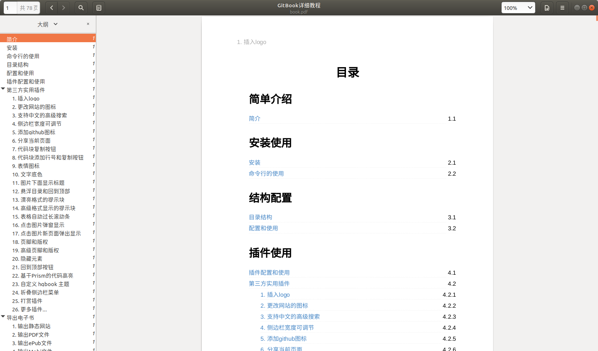

<!-- ex_nonav -->
<!-- ex_nolevel -->

# 导出书籍为PDF格式文件


相信大家对 `PDF` 格式的文件应该不会陌生的吧，在实际生活的场景中，PDF 文件也是比较常见的，比如电子发票，公告文档，材料文档，说明文档等等... 

接下来就来介绍一下 `Gitbook` 中将书籍怎么导出成一个PDF格式的文件。在书籍目录终端中执行 `git book pdf` 命令就可以将书籍导出到书籍目录下的一个名称为 `book.pdf` 的文件了。


**使用示例：**

```bash
# 将书籍导出到PDF文件，如果需要查看生成日志过程，可以加上--log=debug
$ gitbook pdf
info: 28 plugins are installed 
info: 22 explicitly listed 
info: loading plugin "insert-logo"... OK 
info: loading plugin "favicon"... OK 
info: loading plugin "search-pro"... OK 
info: loading plugin "splitter"... OK 
info: loading plugin "github"... OK 
info: loading plugin "sharing-plus"... OK 
info: loading plugin "code"... OK 
info: loading plugin "advanced-emoji"... OK 
info: loading plugin "emphasize"... OK 
info: loading plugin "image-captions"... OK 
info: loading plugin "anchor-navigation-expand"... OK 
info: loading plugin "alerts"... OK 
info: loading plugin "flexible-alerts"... OK 
info: loading plugin "auto-scroll-table"... OK 
info: loading plugin "lightbox"... OK 
info: loading plugin "tbfed-pagefooter"... OK 
info: loading plugin "hide-element"... OK 
info: loading plugin "prism"... OK 
info: loading plugin "chapter-fold"... OK 
info: loading plugin "donate"... OK 
info: loading plugin "fontsettings"... OK 
info: loading plugin "theme-default"... OK 
info: found 38 pages 
info: found 28 asset files 
warn: "options" property is deprecated, use config.get(key) instead 
warn: "options.generator" property is deprecated, use "output.name" instead 
warn: "this.generator" property is deprecated, use "this.output.name" instead 
warn: "navigation" property is deprecated 
warn: "book" property is deprecated, use "this" directly instead 
info: >> generation finished with success in 11.9s ! 
info: >> 1 file(s) generated 

# 查看生成的book.pdf文件
$ tree -L 1
.
├── _book
├── book.json
├── book.pdf
├── images
├── node_modules
├── README.md
└── SUMMARY.md
```


## 效果预览




