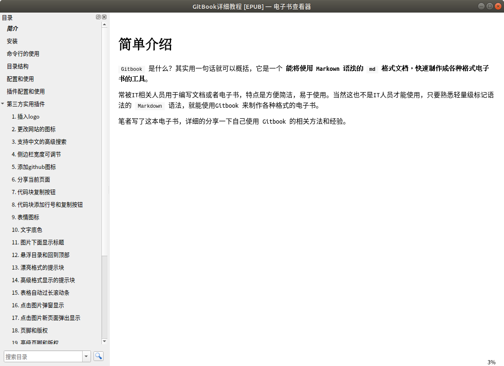

<!-- ex_nonav -->
<!-- ex_nolevel -->

# 导出书籍为ePub格式文件


说起 `ePub` 文件格式，相信大多数人还是比较不熟悉的，相比较 PDF 格式，ePub 格式在日常生活中使用的场景并没有那么平凡，所以这里简单给大家介绍一下 ePub 格式：

ePub（Electronic Publication的缩写，意为：电子出版），是一个自由的开放标准，属于一种可以“自动重新编排”的内容。


**[百度百科中的简介：](https://baike.baidu.com/item/%E7%94%B5%E5%AD%90%E5%87%BA%E7%89%88/8478064?fromtitle=ePub&fromid=9924958#1)**

> [!Note|style:flat]
>
> 电子出版（Electronic  Publishing）是指以数字代码方式将图、文、声、像等信息编辑加工后存储在磁、光、电介质上，信息通过计算机或其他具有类似功能的设备读取使用的一种出版形式。电子出版（elektronisches Publizieren）分成在线电子出版（elektronisches  Online-Publizieren）和离线电子出版（elektronisches Offline-Publizieren）两大类型。
>
> 通常包括前期策划、素材准备、美术设计、程序编制、后期制作或通过网络发送等环节。可见电子出版以计算机为生产工具，原作的大量复制也是以计算机为核心。这里，定义出版时所必需的编辑改为前期策划、素材准备和美术设计等。因此，与传统意义上的出版相比，电子出版包含了更复杂的劳动。工艺手段和技术含量也更高。


在书籍目录终端中执行 `gitbook epub` 命令就可以生成一个名称为 `book.epub` 的文件。


**使用示例：**

```bash
# 将书籍导出到ePub文件，如果需要查看生成日志过程，可以加上--log=debug
$ gitbook epub
info: 28 plugins are installed 
info: 22 explicitly listed 
info: loading plugin "insert-logo"... OK 
info: loading plugin "favicon"... OK 
info: loading plugin "search-pro"... OK 
info: loading plugin "splitter"... OK 
info: loading plugin "github"... OK 
info: loading plugin "sharing-plus"... OK 
info: loading plugin "code"... OK 
info: loading plugin "advanced-emoji"... OK 
info: loading plugin "emphasize"... OK 
info: loading plugin "image-captions"... OK 
info: loading plugin "anchor-navigation-expand"... OK 
info: loading plugin "alerts"... OK 
info: loading plugin "flexible-alerts"... OK 
info: loading plugin "auto-scroll-table"... OK 
info: loading plugin "lightbox"... OK 
info: loading plugin "tbfed-pagefooter"... OK 
info: loading plugin "hide-element"... OK 
info: loading plugin "prism"... OK 
info: loading plugin "chapter-fold"... OK 
info: loading plugin "donate"... OK 
info: loading plugin "fontsettings"... OK 
info: loading plugin "theme-default"... OK 
info: found 38 pages 
info: found 29 asset files 
warn: "options" property is deprecated, use config.get(key) instead 
warn: "options.generator" property is deprecated, use "output.name" instead 
warn: "this.generator" property is deprecated, use "this.output.name" instead 
warn: "navigation" property is deprecated 
warn: "book" property is deprecated, use "this" directly instead 
info: >> generation finished with success in 4.5s ! 
info: >> 1 file(s) generated 

# 查看生成的book.epub文件
$ tree -L 1
.
├── _book
├── book.epub
├── book.json
├── images
├── node_modules
├── README.md
└── SUMMARY.md
```


## 效果预览




