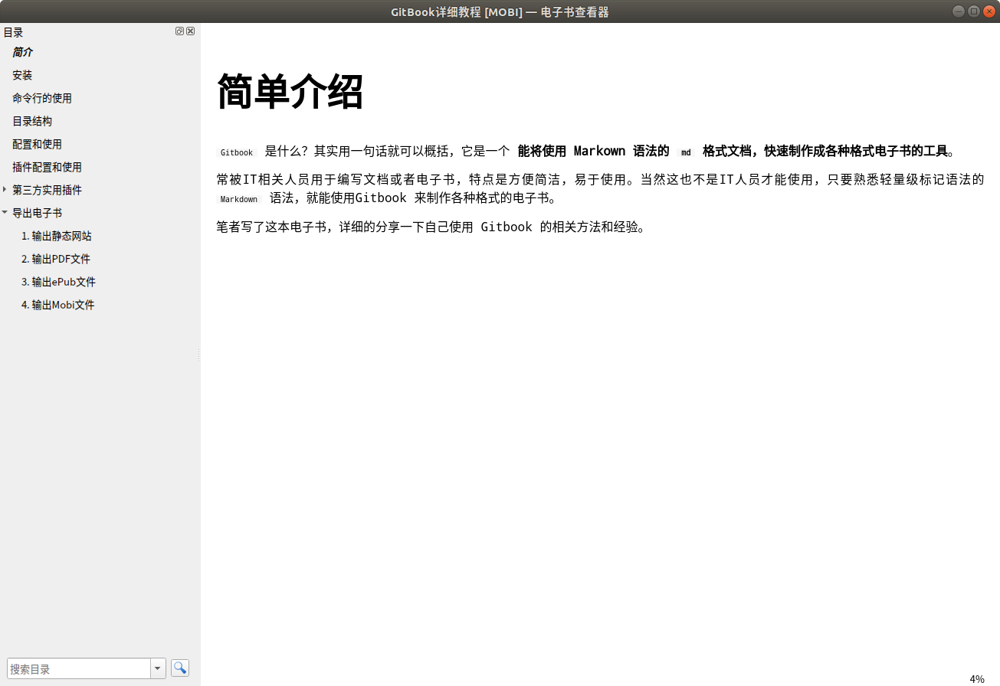

# 导出书籍为Mobi格式文件


**Mobi是什么文件格式？**

`mobi` 格式是一种广泛流行于网络的电子书格式，是亚马逊电子书格式，可以用亚马逊电子设备打开观看，也可用电脑打开，但需要使用特定的工具才能打开。


在书籍目录终端中执行 `gitbook mobi` 命令就可以生成一个名称为 `book.mobi` 的文件。


**使用示例：**

```bash
# 将书籍导出到Mobi文件，如果需要查看生成日志过程，可以加上--log=debug
$ gitbook mobi
info: 28 plugins are installed 
info: 22 explicitly listed 
info: loading plugin "insert-logo"... OK 
info: loading plugin "favicon"... OK 
info: loading plugin "search-pro"... OK 
info: loading plugin "splitter"... OK 
info: loading plugin "github"... OK 
info: loading plugin "sharing-plus"... OK 
info: loading plugin "code"... OK 
info: loading plugin "advanced-emoji"... OK 
info: loading plugin "emphasize"... OK 
info: loading plugin "image-captions"... OK 
info: loading plugin "anchor-navigation-expand"... OK 
info: loading plugin "alerts"... OK 
info: loading plugin "flexible-alerts"... OK 
info: loading plugin "auto-scroll-table"... OK 
info: loading plugin "lightbox"... OK 
info: loading plugin "tbfed-pagefooter"... OK 
info: loading plugin "hide-element"... OK 
info: loading plugin "prism"... OK 
info: loading plugin "chapter-fold"... OK 
info: loading plugin "donate"... OK 
info: loading plugin "fontsettings"... OK 
info: loading plugin "theme-default"... OK 
info: found 38 pages 
info: found 31 asset files 
warn: "options" property is deprecated, use config.get(key) instead 
warn: "options.generator" property is deprecated, use "output.name" instead 
warn: "this.generator" property is deprecated, use "this.output.name" instead 
warn: "navigation" property is deprecated 
warn: "book" property is deprecated, use "this" directly instead 
info: >> generation finished with success in 6.0s ! 
info: >> 1 file(s) generated 

# 查看生成的book.mobi文件
$ tree -L 1
.
├── _book
├── book.json
├── book.mobi
├── node_modules
├── README.md
└── SUMMARY.md
```


## 预览效果




<!-- ex_nonav -->
<!-- ex_nolevel -->