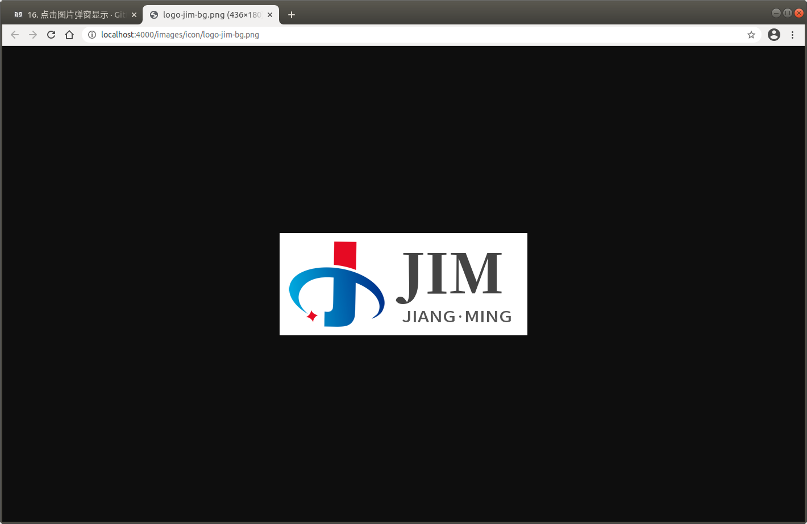

# popup 点击图片新页面弹出显示


可以单击图片，在`新页面查看大图显示`。

**配置使用方法：**

```json
{
  "plugins": [ "popup" ]
}
```

插件 Github 地址：[https://github.com/somax/gitbook-plugin-popup](https://github.com/somax/gitbook-plugin-popup)


**效果预览：**





<!-- ex_nonav -->
<!-- ex_nolevel -->