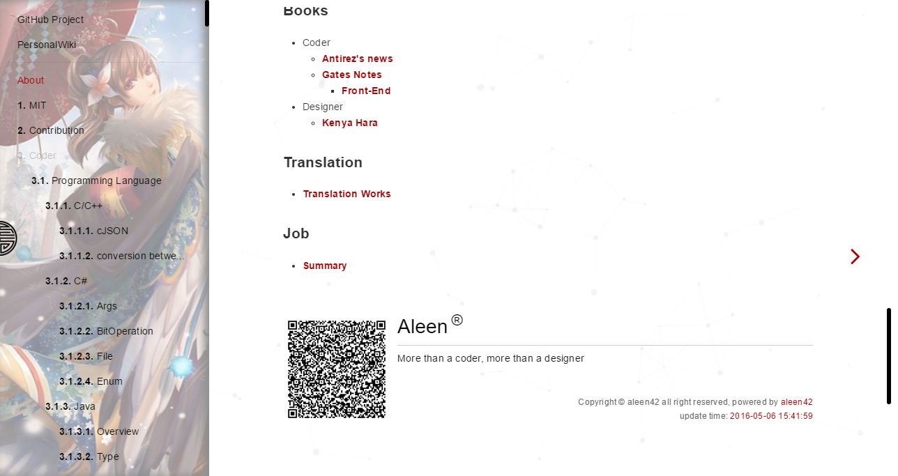
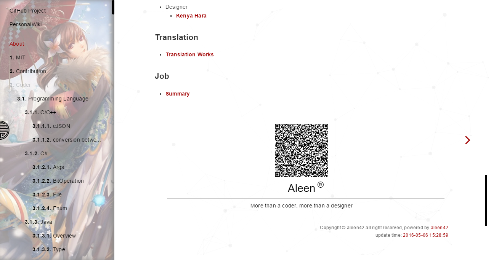
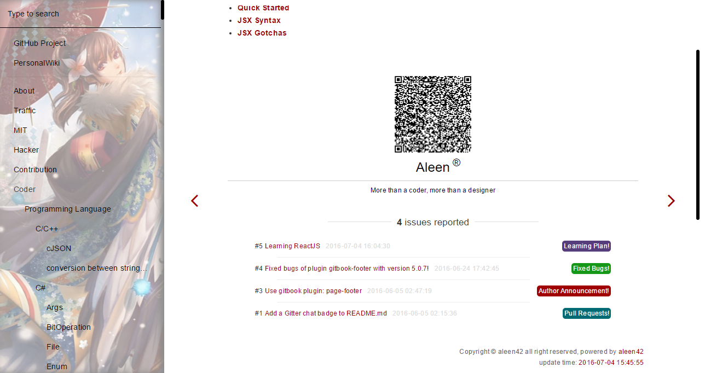

# page-footer 高级页脚和版权


`更高级的页脚版权信息的插件`，支持`normal`，`symmetrical`，`Issues`三种不同样式的形式。

**配置使用方法：**

```json
{
    "plugins": [
        "page-footer"
    ],
    "pluginsConfig": {
        "page-footer": {
            "description": "modified at",
            "signature": "Aleen",
            "wisdom": "More than a coder, more than a designer",
            "format": "yyyy-MM-dd hh:mm:ss",
            "copyright": "Copyright &#169; aleen42",
            "timeColor": "#666",
            "copyrightColor": "#666",
            "utcOffset": "8",
            "isShowQRCode": true,
            "baseUri": "https://aleen42.gitbooks.io/personalwiki/content/",
            "isShowIssues": true,
            "repo": "aleen42/PersonalWiki",
            "issueNum": "8",
            "token": "",
            "style": "normal"
        }
    }
}
```

插件 Github 地址：[https://github.com/aleen42/gitbook-footer](https://github.com/aleen42/gitbook-footer)


**效果预览：**

Normal效果：




Symmetrical效果：




Issues效果：




<!-- ex_nonav -->
<!-- ex_nolevel -->