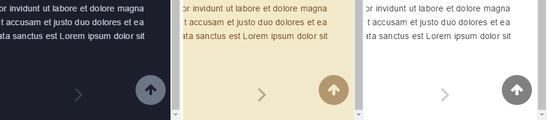

# back-to-top-button 回到顶部按钮


可以在浏览文章到`一定长度`的时候，显示一个`回到顶部的快捷按钮`，点击可以快速回到文章顶部。

**配置使用方法：**

```json
{
    "plugins": [
         "back-to-top-button"
    ]
}

```
插件 Github 地址：[https://github.com/stuebersystems/gitbook-plugin-back-to-top-button](https://github.com/stuebersystems/gitbook-plugin-back-to-top-button)


**效果预览：**




<!-- ex_nonav -->
<!-- ex_nolevel -->