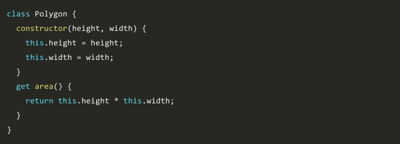
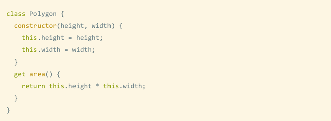
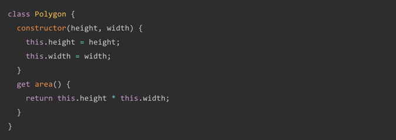

# prism 基于 Prism 的代码高亮


`prism` 基于 [Prism](https://prismjs.com/) 的代码高亮插件，可以为代码块配置不同的主题风格。

**配置使用方法：**

```json
{
    "plugins": [
        "prism",
        "-highlight"
    ],
    "pluginsConfig": {
        "prism": {
            "css": [
                "prismjs/themes/prism-solarizedlight.css"
            ],
            "lang": {
                "flow": "typescript"
            },
            "ignore": [
                "mermaid",
                "eval-js"
            ]
        }
    }
}
```
配置参数介绍：
- `css`：指定自定义主题的样式文件。
- `lang`： 配置自定义语言前缀名，来混淆配置。
- `ignore`：由于其他插件使用自定 `lang` 代码块的概念来表示其他功能，你可以忽略某些 langs。

插件 Github 地址：[https://github.com/gaearon/gitbook-plugin-prism](https://github.com/gaearon/gitbook-plugin-prism)


**效果预览：**

prism-okaidia.css预览：




prism-solarizedlight.css预览：




prism-tomorrow.css预览：





更多主题效果参考：<https://github.com/gaearon/gitbook-plugin-prism>


<!-- ex_nonav -->
<!-- ex_nolevel -->