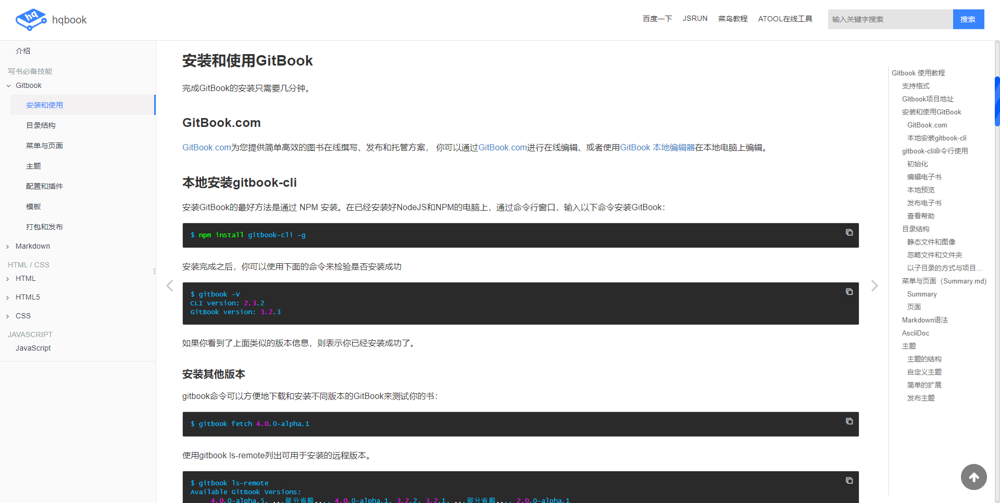

# theme-hqbook 自定义 hqbook 主题


`Gitbook` 也支持`通过插件的方式来自定义主题`，在 Github中可能有很多主题资源，但是不是非常建议大家去使用第三方的主题，因为第三的主题可能会导致一些不兼容的情况或者各种问题。


> [!DANGER|style:flat|lable:特别注意]
> `hqbook` 主题其实也是不是非常完善的，比如不能很好的适配移动端，在移动端访问，界面就可能出现各种不协调的地方，截止到目前为止，笔者还没有发现一个比较完善的主题，本节仅供大家参考，具体的使用还是需要自己去研究或者有能力的情况自行开发一套哈。

**配置使用方法：**

```json
{
    "plugins": [
        "theme-hqbook"
    ],
    "variables": {
        "themeHqbook":{
            "nav":[
                {
                    "url": "https://blog.csdn.net/ming_97y",
                    "target": "_blank",
                    "name": "Blog"
                },
                // { ... }
            ]
        },
    },
    "pluginsConfig": {
        "theme-hqbook":{
            "favicon": "./favicon.ico",
            "logo":"./logo.png",
            "search-placeholder":"输入关键字搜索",
            "copyButtons": true,
            "copyLines": true,
            "dragSplitter": true,
            "hide-elements": [
                ".summary .gitbook-link"
            ],
            "flexible-linkcard": {
                "title": "flexible-linkcard",
                "hrefUrl": "https://github.com/HaoqiangChen/gitbook-plugin-flexible-linkcard",
                "target": "_blank",
                "imgSrc": "./book/logo.png",
                "imgClass": "rect"
            }
        }
    }
}
```

**参数简单介绍：**

- `favicon`：自定义favicon地址，修改标题栏图标
- `logo`：自定义logo地址，修改logo
- `search-placeholder`：搜索框提示信息
- `copyButtons`：代码块添加复制按钮
- `copyLines`：当显示多行代码时，将添加行号
- `dragSplitter`：在左侧目录和右侧内容之间添加一个可以拖拽的栏，用来调整两边的宽度
- `hide-elements`：隐藏元素，比如导航栏中Published by GitBook
- `nav`：顶部导航栏，nav为数组，将需要的导航添加到变量themeHqbook中

- `flexible-linkcard`：

1. `title` : 定义flexible-linkcard的默认标题
2. `hrefUrl` : 定义flexible-linkcard的默认网址
3. `target` : 定义flexible-linkcard的网址默认打开方式，即`HTML<a>的target属性，属性值有_seft, _blank, _parent, _top`几种，最好还是设置_blank新窗口打开
4. `imgSrc` : 定义flexible-linkcard的默认显示图片
5. `imgClass` : 定义flexible-linkcard的默认图片样式

插件 Github 地址：[https://github.com/HaoqiangChen/gitbook-plugin-theme-hqbook](https://github.com/HaoqiangChen/gitbook-plugin-theme-hqbook)


**效果预览：**




<!-- ex_nonav -->
<!-- ex_nolevel -->