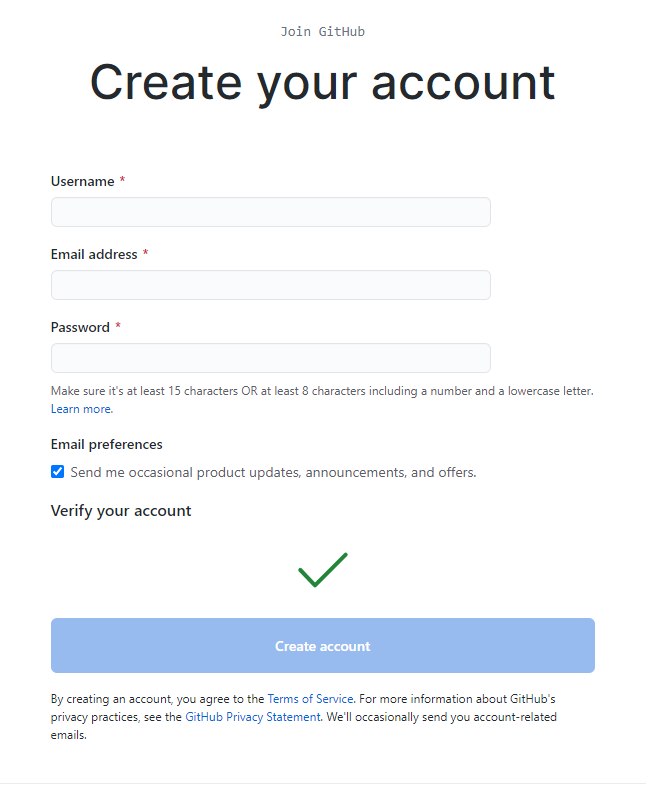
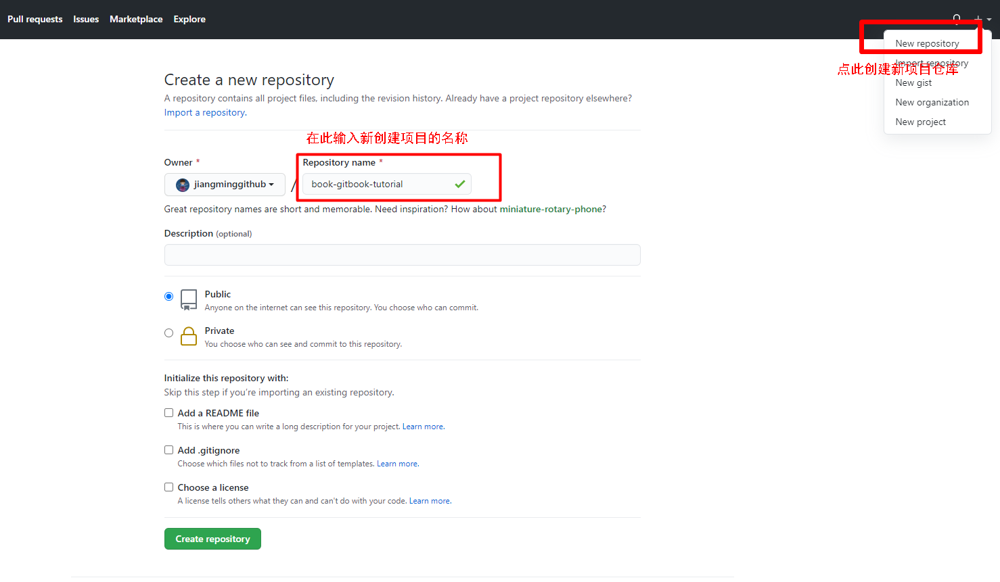
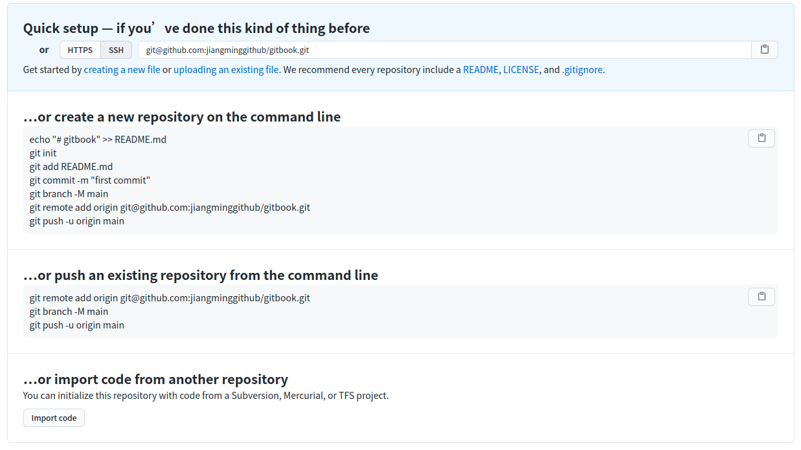
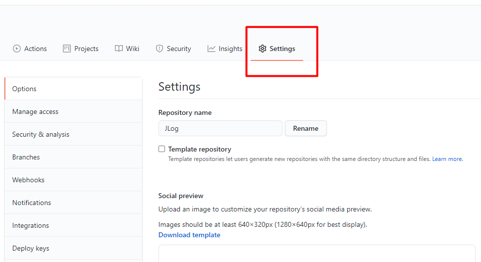
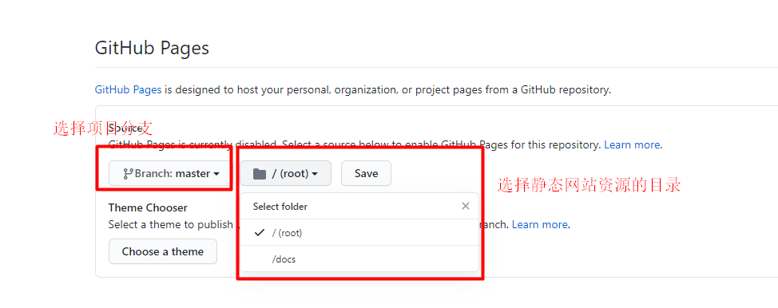

# 发布到Github Pages

这个功能主要是将我们的书籍项目**编译成静态网站文件**，然后将静态网站文件上传到 `Github` 上，使用 Github 的 `Pages` 服务，创建一个属于自己的静态网站的一个功能，然后就可以利用 Github 来访问我们书籍了。

Github 官网也有对提供的 Pages有详细的说明，官网参考：<https://pages.github.com>

## 申请 Github 账号

首先的条件就是需要一个自己的 `Github` 账号，如果没有的话，可以去官网上申请注册一个自己的 Github 账号，官网地址：<https://github.com> 。

**注册如下所示：**

## 创建一个项目仓库

在 `Github` 中创建一个自己的项目仓库，名字按照你的想法去取，没有限制，当然建议大家尽量取一个有意义，简单易于理解的名字。

**如下所示：**

## 推送静态网站文件到Github仓库中

将自己书籍项目编译出来的静态网站文件推送到刚刚创建的 `Github` 中的`项目`中。具体推送的方法这里就不具体细细的介绍了，可以参考相关的 Git 的教程和  Github 新创建项目中的使用说明。

> [!NOTE|style:flat]在这里推荐一个大家学习 `Git` 和 远程仓库的相关教程的学习网站，廖雪峰的Git教程：<https://www.liaoxuefeng.com/wiki/896043488029600>

** github快速使用指南示例参考：**

## 创建 Pages 服务并部署自己的静态网站

在需要创建 Pages 服务的项目中点击 “Settings” 按钮，滑动选项到 `Pages` 选项，选择需要创建 pages 服务的`分支`和`部署的目标资源目录`（目前github仅支持指定`项目的根目录`和`根目录下的docs目录`），选择好之后保存就可以根据提示的`网址链接`来访问你部署的书籍的静态网站了。

> [!TIP|style:flat]
>
> 需要注意，目标仓库中必须有 index.html 才可以正常访问 !

**示意图**：

<!-- ex_nolevel -->